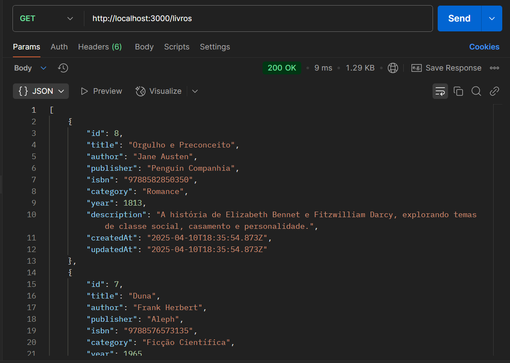
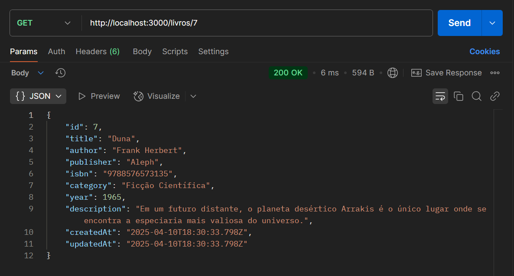
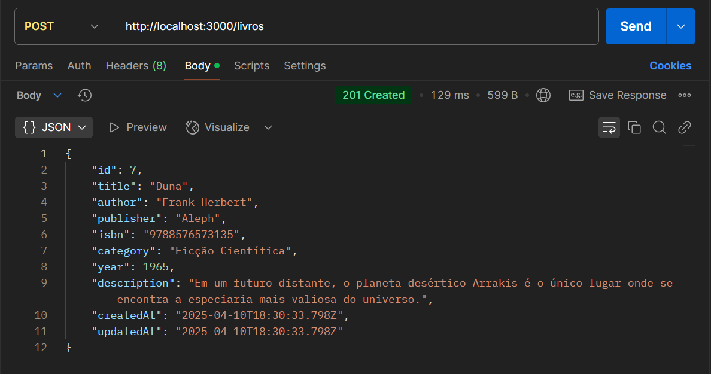
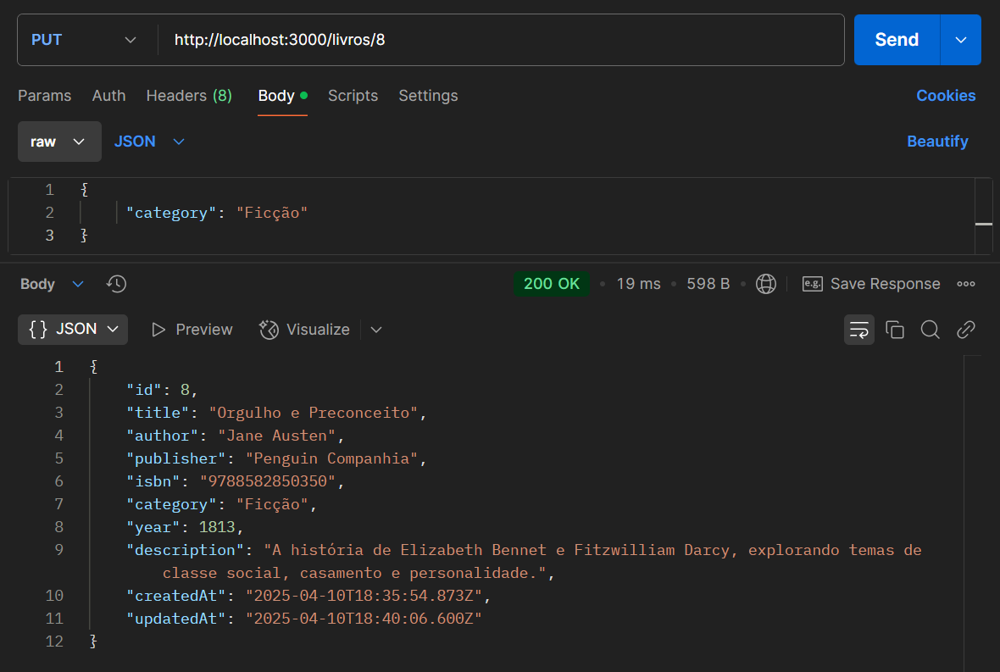
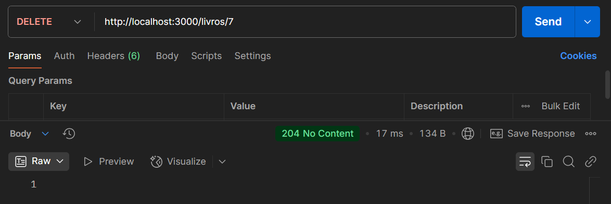

# Desafio: Desenvolvimento de API Backend com CRUD Completo e Prisma ORM

## Contexto

Uma biblioteca municipal está passando por um processo de modernização e precisa de um sistema digital para gerenciar seu acervo de livros. A instituição deseja ter uma plataforma onde possa cadastrar, consultar, atualizar e remover informações sobre os livros disponíveis para empréstimo. Para isso, é necessário desenvolver uma API backend que permitirá a gestão completa do acervo bibliográfico.

## Insruções de instalação 

- Clone o repositório
- Dê um npm install para instalar as dependências
- Crie um arquivo .env na raiz do projeto com DATABASE_URL="file:./dev.db" para usar o SQLite
- Execute npx prisma migrate dev para criar o banco de dados SQLite
- Execute npm run dev para iniciar o servidor

## Modelagem dos dados - Tabela de livros

```prisma
model Livro {
  id           Int    @id @default(autoincrement())
  title        String
  author       String
  publisher    String
  isbn         String
  category     String
  year         Int?
  description String?
  createdAt DateTime @default(now())
  updatedAt DateTime @updatedAt

  @@map("livros")
}
```

## Métodos CRUD

- **Read** `getAllLivros`: Listar todos os livros da biblioteca



- **Read** `getLivroById`: Obter um livro específico pelo ID



- **Create** `createLivro`: Adicionar um novo livro há biblioteca



- **Update** `updateLivro`: Atualizar as informações de um livro existente



- **Delete** `deleteLivro`: Remover um livro da biblioteca



## Decisões de Design e Arquitetura

### Implementação da Arquitetura MVC (Requisito do Projeto)
O projeto implementa o padrão Model-View-Controller (MVC) conforme exigido na atividade:
- **Model**: Representação dos dados e lógica de negócio via Prisma ORM
- **Controller**: Gerenciamento de requisições e respostas HTTP
- **Routes**: Definição das rotas da API

### Implementação do Prisma ORM (Requisito do Projeto)
A utilização do Prisma como ORM foi um requisito obrigatório da atividade. Implementei aproveitando seus benefícios:
- Type safety com TypeScript
- Migrações automáticas de banco de dados
- Client gerado com base no schema
- Queries seguras e eficientes

### SQLite para Desenvolvimento
O SQLite foi escolhido como banco de dados de desenvolvimento por:
- Configuração zero
- Armazenamento em arquivo único
- Ideal para desenvolvimento e testes
- Fácil migração para PostgreSQL/MySQL em produção

### Validações
Implementei validações no controlador para garantir:
- Campos obrigatórios estão preenchidos
- Formato correto dos dados
- Feedback adequado ao usuário

### Estrutura de Arquivos

```js
/src
  /controllers - Lógica de negócio
  /models - Interação com o banco
  /routes - Definição de endpoints
  /images - Imagens da documentação
/prisma - Schema e configuração do ORM
```
## Tecnologias Utilizadas

### Backend
- **Node.js** - Ambiente de execução JavaScript
- **Express** - Framework web para criação de APIs RESTful
- **Prisma ORM** - ORM moderno para Node.js e TypeScript
- **SQLite** - Banco de dados relacional embutido

### Ferramentas de Desenvolvimento
- **Nodemon** - Reinicialização automática do servidor durante desenvolvimento
- **dotenv** - Gerenciamento de variáveis de ambiente
- **Git** - Sistema de controle de versão

### Teste e Documentação
- **Postman** - Plataforma para teste e documentação de APIs
